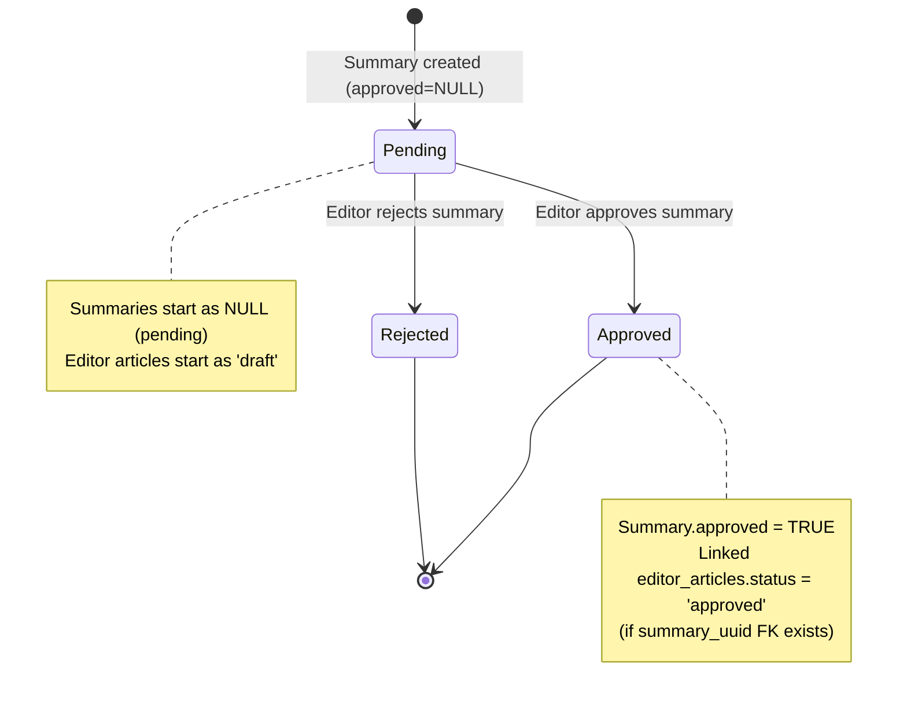
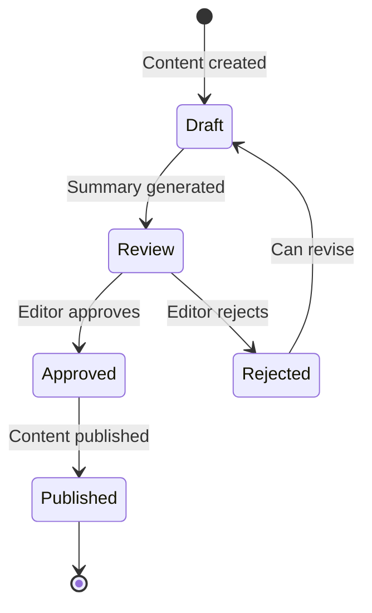

### 1. Current State Diagram



### 2. Data Flow Map

```mermaid
graph TD
    A[Articles Table] --> B[Summarize API]
    B --> C[Summaries Table<br/>approved=NULL]
    A --> D[Articles Page<br/>AI Generate Metadata]
    D --> E[Editor Articles Table<br/>status='draft'<br/>summary_uuid=NULL]
    C --> F[Queue Page<br/>Summary Review]
    F --> G[Summary Approved<br/>approved=TRUE]
    G --> H[Update Editor Articles<br/>status='approved'<br/>WHERE summary_uuid matches]
    
    note right of E
        Editor articles created without summary_uuid FK
        No automatic linking to summaries
    end note
    
    note right of H
        FK update fails if summary_uuid not set
        Editor articles remain 'draft' after summary approval
    end note
```

### 3. Approval Logic Gaps

- **Missing FK Relationship**: Editor articles are created without `summary_uuid`, breaking the approval cascade from summaries to editor articles
- **Reverse Dependency**: Summaries are approved first, but editor articles (containing AI metadata) should drive the approval workflow
- **Dual Status Management**: Two separate status fields (`summaries.approved` boolean vs `editor_articles.status` string) with inconsistent updates
- **No Validation**: Creating editor articles doesn't check if related summaries exist or are approved
- **Queue Visibility**: Approved editor articles may not appear in queue because status updates fail due to missing FK

### 4. Version Management Issues

- **No Deduplication**: Multiple editor articles can be created for the same source article without constraints
- **Unlinked Versions**: Each editor article version exists independently, not tied to summary versions
- **UI Clutter**: EditorArticlesPage shows all versions without grouping by source article or summary
- **Status Inconsistency**: Versions can have different approval statuses for the same content
- **No Version Control**: No mechanism to track which version is "current" or "published"

### 5. Recommended Architecture

**Phase 1: Unified Content Entity**
- Create `content_versions` table linking articles → summaries → editor_articles
- Single approval status per content chain
- Version numbering with `is_current` flag

**Phase 2: Workflow States**


**Phase 3: Clean Separation**
- **Summaries**: AI-generated, quality-scored, approval-gated
- **Editor Articles**: Human-enhanced versions with platform metadata
- **Scripts**: Generated from approved summaries for TTS/audio
- **Queue**: Single unified view filtering by content status

**Phase 4: Implementation Changes**
- Add `content_uuid` FK in both summaries and editor_articles tables
- Update creation APIs to establish relationships automatically
- Modify approval logic to update entire content chain
- Add version management UI with diff views
- Implement content lifecycle hooks for status synchronization